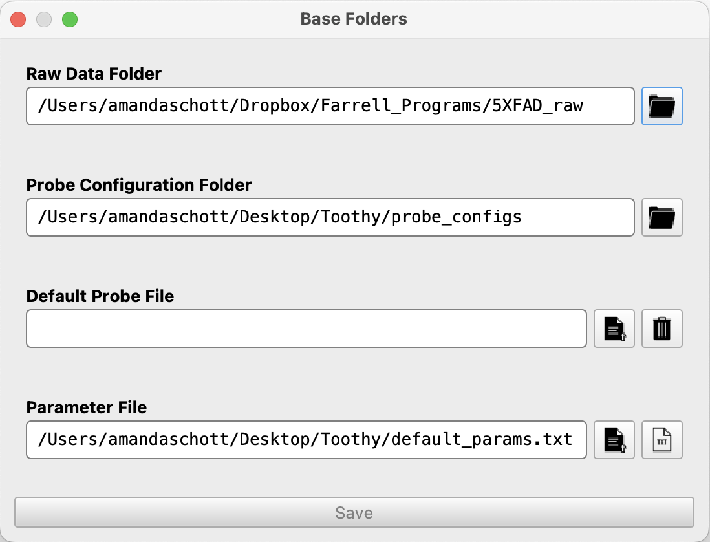
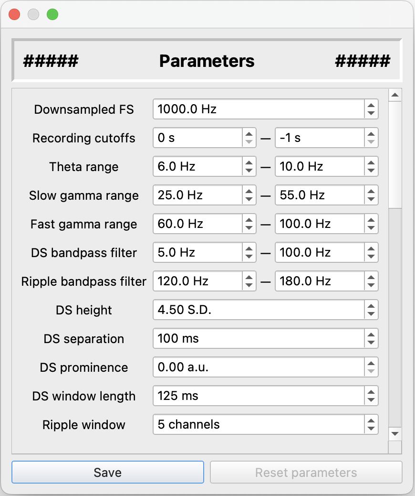

# Farrell-Lab

## Installation
1) Download Miniconda or Anaconda Navigator
* Miniconda: https://docs.anaconda.com/miniconda/miniconda-install/
* Anaconda Navigator: https://www.anaconda.com/download
  * Navigator provides a GUI and a large suite of packages/applications, but takes up much more disk space

2) Download the Toothy ZIP file from GitHub and move the folder to the desired location

3) Open an Anaconda Prompt terminal window and set the current directory to the Toothy folder
```
cd [PATH_TO_TOOTHY_FOLDER]
```
* e.g. ```cd C:\Users\Amanda Schott\Documents\Data\Toothy-main```

6) Create a new Anaconda environment for the Toothy application using the provided ```environment.yml``` file, then activate your new environment
```
conda env create -f environment.yml
conda activate toothy_gui_env
```

7) Run the application!
```
python toothy.py
```

## Getting Started

### <u>Set your "Base Folders"</u>
The "Base Folders" window allows you to set default folders and files for data analysis. This information is stored in a ```default_folders.txt``` file, which is automatically generated upon startup.

<p align="center"></p>

**<u>Raw Data:</u>** Select the directory where your raw data files are stored; the default location is the Toothy folder itself. Updating this location is optional but convenient for selecting raw recording data for initial processing.

**<u>Probe Files:</u>** Select the directory where your probe configuration files will be stored. The application automatically creates a ```probe_configs``` directory within the Toothy folder and creates a ```demo_probe_config.json``` file as an example probe object.

**<u>Default Probe:</u>** If your recordings tend to use the same probe, you can optionally select a default probe configuration file that will be automatically loaded during the data processing phase. If this field is blank (the default state), probes will be loaded manually for each recording.

**<u>Default Parameters:</u>** Select the TXT file containing the parameter values that you want to use for data processing. The application automatically generates a ```default_params.txt``` file with reasonable initial values, which can be changed in the next step. To generate a new parameter file with default values, press the "TXT" file button.

---

### <u>Set your analysis parameters</u>
The "Parameters" window allows you to view and edit the parameters used for data processing and analysis, which are stored in the TXT file specified in the previous step.

<p align="center"></p>

You can display a short description of each parameter by hovering over its label, and changes can be saved either to the current parameter file or as a new TXT file.

---

### <u>Create a probe configuration file</u>
The probe designer uses the ```probeinterface``` Python package to create a software representation of the electrode geometry and channel mapping of specific neural probes, which is stored as a JSON file.

