# Toothy: a graphical user interface for curating dentate spikes

# Installation
**1) Download Miniconda or Anaconda Navigator**
* Miniconda: https://docs.anaconda.com/miniconda/miniconda-install/
* Anaconda Navigator: https://www.anaconda.com/download
  * Navigator provides a GUI and a large suite of packages/applications, but takes up much more disk space

**2) Download the Toothy repository as a ZIP file from GitHub. Unpack the ZIP to create a folder, referred to below as the "Toothy folder."**

**3) Open an Anaconda Prompt terminal window and navigate to the Toothy folder.**
```
cd [PATH_TO_TOOTHY_FOLDER]
```
* e.g. ```cd C:\User\Documents\Data\Toothy-main```

**4) Create a new Anaconda environment for the Toothy application using the provided ```environment.yml``` file. The following command creates a Python 3.11 environment called "toothy_env"  and installs all the necessary dependencies.**
```
conda env create environment.yml
```
*If you already have an environment called `toothy_env`, remove it first by running: `conda remove --name toothy_env --all` or change the name of the environment inside `environment.yml`.*

**5) Activate the environment.**
```
conda activate toothy_env
```

**7) Run the application!**
```
python toothy.py
```

<br>

# Getting Started
The Toothy workflow consists of three key steps: (1) **data ingestion**, in which you select a recording and relevant metadata, (2) **channel selection**, in which you pick the best channel for hippocampal events based on the properties of the events detected on each channel, and (3) **DS classification**, in which you set clustering parameters to classify DSs into DS1/DS2. To begin, click "Step 1: Load data" on the Toothy home screen.

<p align="center">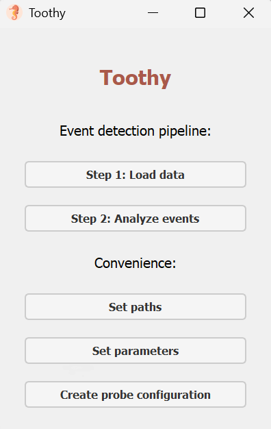</p>

# Data Ingestion

The "Raw Data" window provides a pipeline for loading raw recordings, assigning probes, pre-processing the data, and saving the files in a new ```processed_data``` folder. Users can also set the analysis parameters for a given recording by expanding the "Settings" panel.

<p align="center">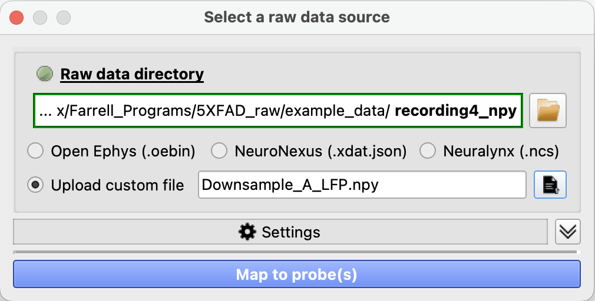</p>

### <ins>Loading Data from a Supported Recording System</ins>

<p></p>
Toothy supports automatic data loading from the following acquisition systems:

* **<ins>NeuroNexus</ins>:** data source must contain a ```.xdat.json``` metadata file
* **<ins>OpenEphys</ins>:** data source must contain a ```structure.oebin``` metadata file
* **<ins>Neuralynx</ins>:** data source must contain unique ```.ncs``` files for each channel

<p>: select raw data directory from a supported recording system</p>
<p>: select raw data file in a supported format (see below)</p>

### <ins>Loading Data from a File</ins>

<p align="center">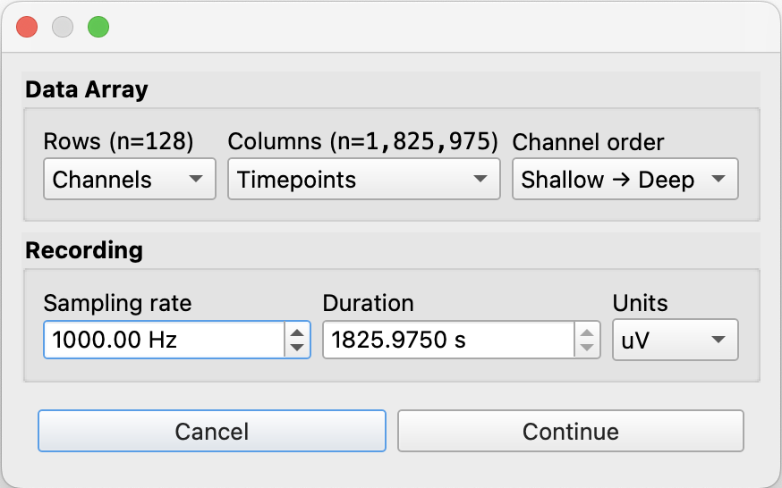</p>

To analyze electrophysiology signals from a non-supported recording system, Toothy can also load 2-dimensional data arrays (channels x timepoints) from ```.npy``` and ```.mat``` files. Since these files lack contextual metadata, the user must provide information about the recording into a popup window.

<p></p>
<b>Data Array:</b> label data dimensions and channel ordering

* Specify whether data rows represent channels or time points
* Specify whether the data channels are organized from shallowest to deepest (or vice versa)

<p></p>
<b>Recording:</b> set key recording parameters

* Set the recording sampling rate (Hz); the recording duration is automatically calculated using the number of time points
* Set the SI units (uV, mV, V, or kV) of the data

<hr>

### <ins>Assigning Probes</ins>

After the raw data source is loaded, each data row must be mapped to a unique probe channel. The central panel shows all probes currently associated with the recording, and a dynamically updated text box (right) displays the total number of probe channels along with the number of data rows; these values must be identical in order to proceed.

<p align="center">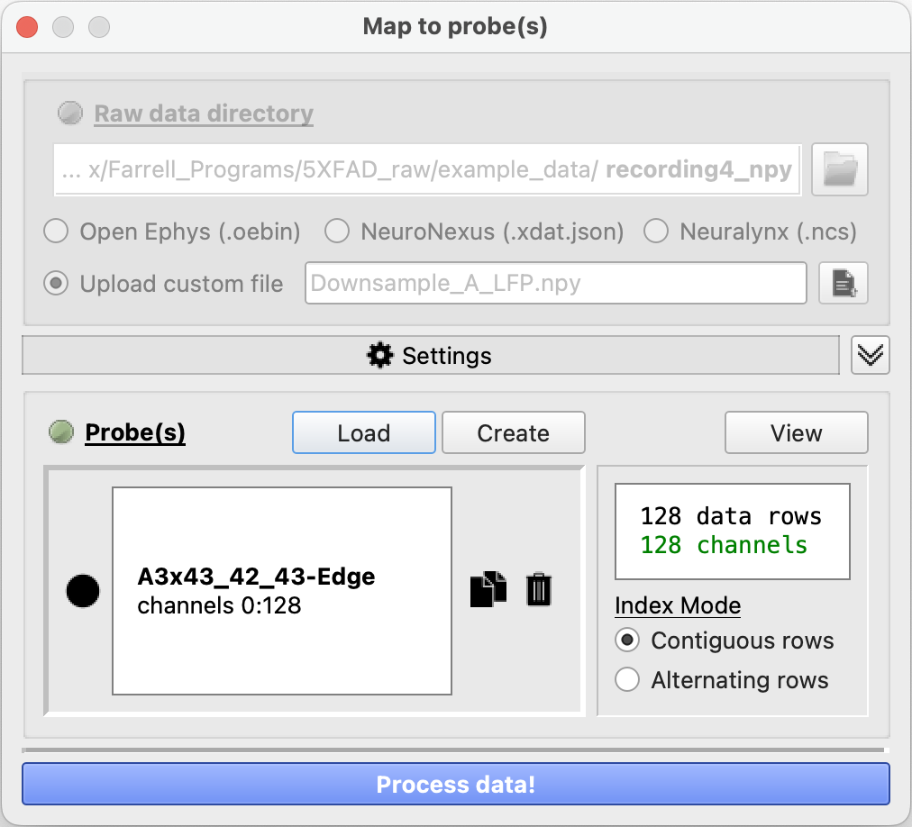</p>

<p></p>
<b>Assign probes to the recording:</b><br>
<ins>Load</ins> button: load an existing probe configuration file<br>
<ins>Create</ins> button: open the probe designer window to make a new probe<br>
<p>: duplicate assigned probe and add to the recording</p>
<p>: remove assigned probe from the recording</p>

<p></p>
<b>Set indexing mode:</b><br>
<ins>Contiguous rows</ins>: each probe is assigned to a block of N consecutive rows in the data array<br>
<ins>Alternating rows</ins>: each probe is assigned to N rows evenly distributed throughout the array

<p></p>
<b>View probe assignments</b><br>
<ins>View</ins> button: display a table with all data rows and their corresponding probe IDs

* For unassigned rows, the "Probe" column is left blank

<br><br>

# Analyzing the Recording

The  "Data Analysis" window manages event channel selection and DS classification for processed recordings, which can be selected using the file button.

<p align="center">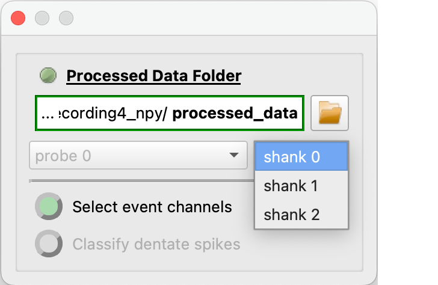</p>

For a valid recording folder, the window will display dropdown menus allowing the user to select a specific probe and shank for analysis; the example recording has one probe and three individual shanks

<ins>"Select event channels":</ins> launches the main analysis GUI for visualizing recording data, determining optimal event channels, and curating event datasets.

<ins>"Classify dentate spikes":</ins> launches the DS classification GUI for estimating CSDs and identifying DS1 vs DS2 dentate spikes. This option is enabled when the user saves an optimal DS channel and dataset via the main analysis GUI.

<br><br>

# Selecting Event Channels

The channel selection window contains numerous interactive features for analyzing hippocampal recordings, with the main goal of determining the optimal LFP channels for dentate spikes, sharp-wave ripples, and theta frequency band power (indicating the hippocampal fissure).

<p align="center">
  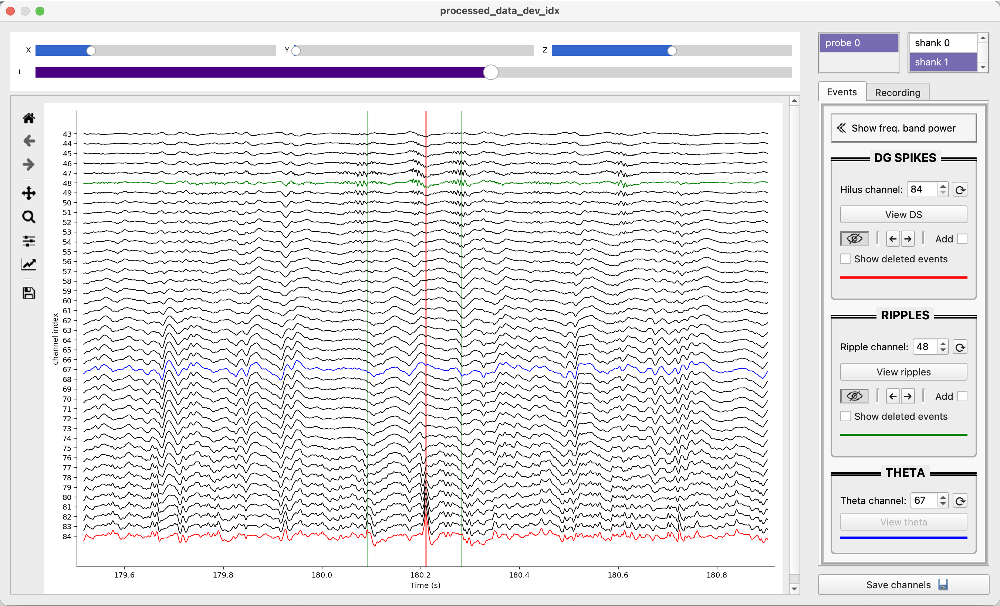
  &nbsp;
  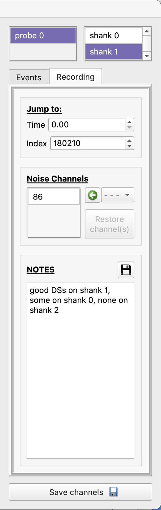
</p>

## General Controls

The central plot shows the LFP signal for each channel on a given shank in the selected probe, which can be toggled using the lists in the top right hand corner. The plot initially shows a 2 second viewing window in the middle of the recording, which can be moved and scaled using the above sliders.

<p></p>
<b><ins>Navigation</ins>:</b> the <i>main slider (purple)</i> controls the position of the viewing window, allowing users to quickly scroll through the recording

* *<ins>Left and right arrow keys</ins>:* shift the viewing window back and forth by 25%, allowing users to incrementally step through the data

<p></p>
<b><ins>Scaling</ins>:</b> the <i>secondary sliders (blue)</i> control the width, height, and data amplitude of the viewing window

* *<ins>X slider</ins>:* adjusts the time range of the viewing window to zoom in/out of the recording
* *<ins>Y slider</ins>:* adjusts the height of the central plot to zoom in/out on LFP channels
* *<ins>Z slider</ins>:* adjusts the amplitude of each LFP to flatten or magnify the signal

<p></p>
<b><ins>Live CSD Plotting</ins>:</b> a <i>span selector (red box)</i> is used to select a time interval for calculating a current source density (CSD) plot

(1) Click and drag the mouse across the central plot to visually select the desired time range<br>
(2) Press the ```Enter``` key to estimate the CSD, displaying the resulting heatmap over the selected LFPs


## The Recording Tab

The "Recording" tab in the settings sidebar contains generally useful widgets for navigating, cleaning, and taking notes on the current recording.

<p></p>
<b><ins>Jump To</ins>:</b> centers the viewing window at a specific position, allowing users to quickly jump between events of interest

* *<ins>Time</ins>:* jump to the given time point (s)
* *<ins>Index</ins>:* jump to the given recording index

*To copy a time point or index to the clipboard, right-click the central plot and select "Copy time" or "Copy index" in the popup menu*

<p></p>
<b><ins>Noise Channels</ins>:</b> designates channels as "clean" (default) or "noise" (unsuitable for event detection). Noisy channels are shown as flat gray lines on the central plot, and their data is ignored when normalizing channel data, calculating CSDs, plotting frequency band power, etc.

* <ins>Set Channel as Noise</ins>: select the target channel item in the dropdown menu, then click the green arrow button to move the channel to the "noise" list
* <ins>Set Channel as Clean</ins>: select the target channel item in the "noise" list, then click the "Restore channel(s)" button to reclassify the channel as "clean"

*Users can also right-click the LFP channel in the central plot and select "Mark as noise" or "Mark as clean" in the popup menu*

<p></p>
<b><ins>NOTES</ins>:</b> built-in documentation that links the text input field to a <code>notes.txt</code> file in the recording folder.

* <p align="left">The GUI automatically loads the contents of the text file on startup, and the  button writes the current content of the text field to disk</p>

## The Events Tab

<p></p>
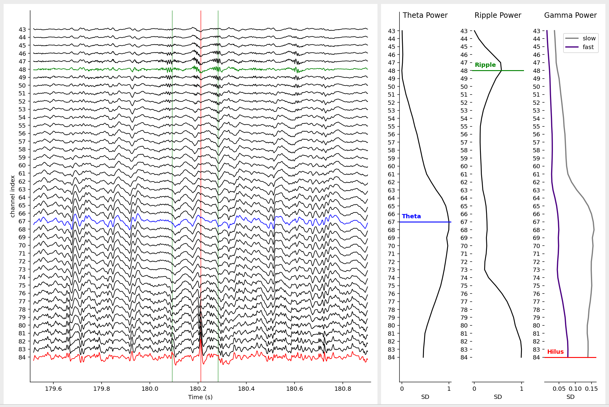

### <ins>Frequency Band Plots</ins>

Frequency band plots display the relative power in the theta (~6-10 Hz), ripple (~120-180 Hz), and gamma (~25-55 Hz; ~60-100 Hz) frequency bands across all shank channels. The Y-axes of the frequency plots align with the central plot for cross-referencing, and the current event channels (see below) are marked by color-coded lines and dynamically updated.

* <ins>"Show freq. band power"</ins> button: toggles the visibility of the frequency band plots

* Designated "noise" channels appear as blank spaces and are not used in normalization

<br>

### <ins>Event Boxes</ins>

Event boxes are the central hub for setting event channels and analyzing DS and SPW-R datasets.

**<ins>Event Channel Assignment</ins>:** users can set each event channel through the *<ins>channel input</ins>* at the top of the corresponding event box. The LFP signals are color-coded to reflect the current event channels for DSs (red), SPW-Rs (green), and theta power (blue), and the central plot displays DS and SPW-R events detected on the specified channel.

<p align="center"></p>
<p align="left"> button: resets the event channel to its initial value</p>

<hr>

**<ins>Viewing Events</ins>:** DSs and SPW-Rs detected on the current event channels are marked by solid red and green vertical lines on the central plot. Dotted lines are used for events manually added by the user, and dashed lines represent detected events manually deleted by the user.

<p align="left">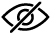 button: toggle visibility of event markers on the central plot</p>

**← →** &nbsp; buttons: move the viewing window to the next (→) or previous (←) event from the current position

<ins>"Show deleted events"</ins> option: toggle visibility of user-deleted events on the central plot

<hr>

**<ins>Editing Events</ins>:** users may curate DS and SPW-R datasets by manually adding or removing event instances

*<ins>Add an Event:</ins>* manually insert a DS or SPW-R at time point *t*<br>
(1) Check the "Add" box for the desired event type<br>
(2) Double-click the mouse on the central plot, as close as possible to time point *t*

*<ins>Delete an Event:</ins>* delete all DS and SPW-R events within a given time span<br>
(1) Click and drag the mouse horizontally across the central plot to surround the target event markers<br>
(2) Press the ```Backspace``` key to delete all visible events within the selected window

*<ins>Restore an Event:</ins>* return previously deleted DS and SPW-R events to their respective datasets<br>
(1) Check the "Show deleted events" box for the desired event type(s)<br>
(2) Click and drag the mouse to surround the target deleted event markers<br>
(3) Press the ```Spacebar``` to restore all deleted events within the selected window

*<ins>Permanently Erase an Event:</ins>* delete all event information so that it cannot be restored<br>
(1) Click and drag the mouse to surround the target event markers<br>
(2) Press the ```Escape``` key to erase all visible events within the selected window

## Event Analysis Popups

For more detailed analysis of DSs and SPW-Rs, users can open event-specific GUIs from the "Events" tab by pressing the *"View DS"* or the *"View ripples"* button. These windows will be initialized with the current event channel as the "primary" channel, allowing users to review individual events (**Single Event Mode**, left) or compare mean event waveforms with other channels (**Average Mode**, right).

**<ins>Static parameter distributions</ins>**<br>
The top row of the GUI displays three statistical subplots comparing events across all channels, with data points color-coded by magnitude for clarity.<br>

(1) <ins>Event count:</ins> number of events detected on each channel<br>
(2) <ins>Event amplitude:</ins> peak amplitudes of DS waveforms or sharp-wave ripple envelopes<br>
(3A) <ins>DS height above surround:</ins> DS waveform peak heights relative to surrounding signal<br>
(3B) <ins>Ripple/theta power:</ins> ratios of ripple power to theta power during SPW-Rs

The *"Highlight data from current channel"* option outlines the data from the primary event channel in red for easy visual identification.

<p align="center">
  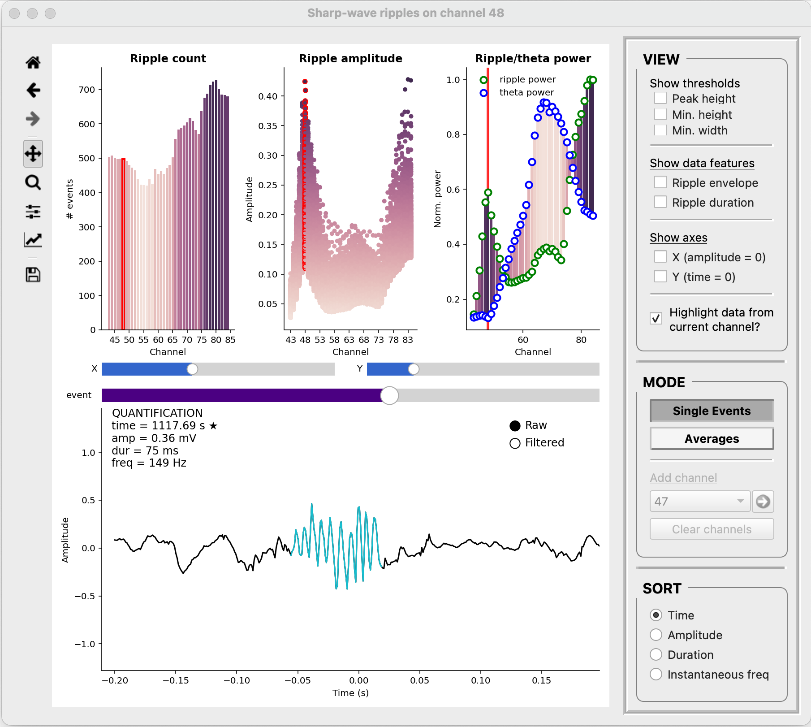
  &emsp;
  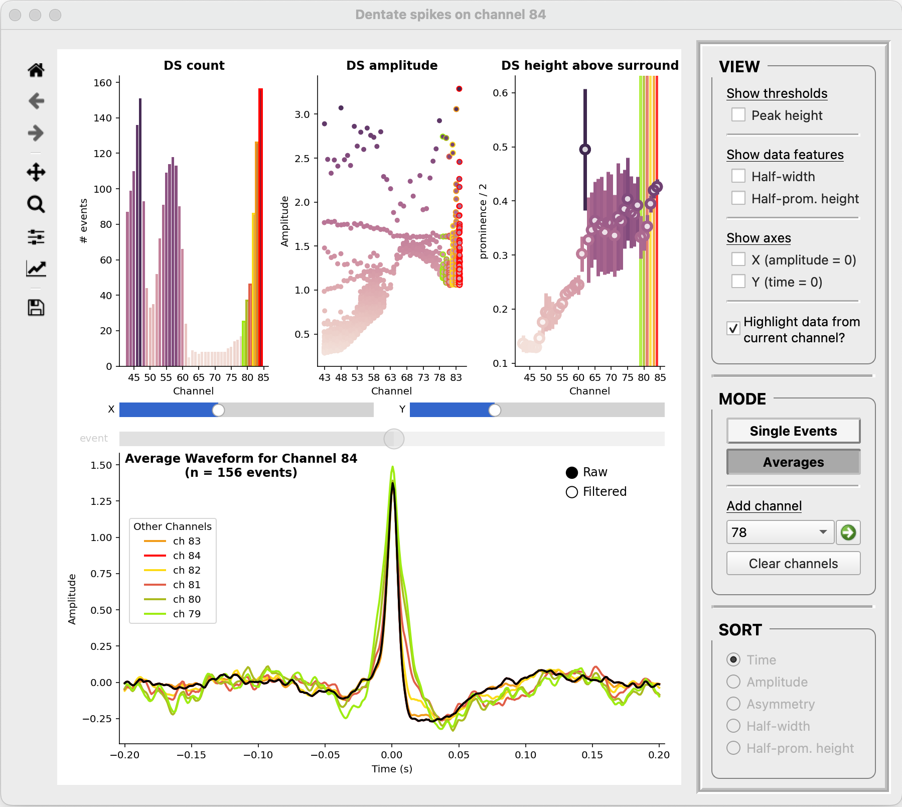
</p>

**<ins>Single Event Mode</ins>**
<p></p>
Users navigate through the set of event waveforms on the primary channel, displayed individually on the plot. The <i>main slider (purple)</i> is used to scroll through the event dataset (in chronological order by default), and the <i>left and right arrow buttons</i> step backward or forward by one event at a time.

* Events can be reordered by any parameter in the **SORT** section of the sidebar, allowing users to inspect the waveforms at each extreme. These attributes are displayed for each event instance as a text annotation

<hr>

**<ins>Average Mode</ins>**
<p></p>
Users compare event morphology between the primary channel and other candidate channels by overlaying their mean LFP waveforms on the same plot. Candidate channels are chosen from the dropdown menu in the <ins>Add channel</ins> section of the sidebar, and the green arrow button adds the event waveform of the selected channel to the plot

* Added waveforms are plotted in a random color, which is displayed in the legend and as a data highlight in the statistical subplots
* The *Clear channels* button removes all added waveforms from the plot, and the primary channel waveform is shown &#177;SEM

<hr>

**<ins>View Options</ins>**

* The *Raw* and *Filtered* plot buttons display either the "standard" LFP signal or the bandpass-filtered LFP used for event detection
* The *X slider* adjusts the size of the event window to show more/less of the surrounding signal
* The *Y slider* scales the Y-axis of the LFP plots
* The **VIEW** parameters in the sidebar control the visibility of various plot annotations
  * <ins>Thresholds</ins>: show or hide event detection thresholds (e.g. min. peak height, min. envelope height, min. ripple duration)
  * <ins>Data Features</ins>: show or hide event attributes (e.g. DS half-width/height at half-prominence, ripple envelope/duration)
  * <ins>Axes</ins>: show or hide X and Y-axes


## Saving Event Data

When all event channel inputs are set to the optimal values, pressing the <ins>Save</ins> button will save the event data for the currently loaded shank and probe. Any probe shanks without saved data are missing from the following CSV tables and represented as empty lists in the event channel file.

```theta_ripple_hil_chan_[PROBE].npy``` : a nested list of [theta, SPW-R, DS] channels for each shank in the probe

```DS_DF_[PROBE]``` and ```SWR_DF_[PROBE]``` : CSV files containing DS and SPW-R datasets for the probe

<br><br>

# Classifying Dentate Spikes

The DS classification window is used to estimate current source density (CSD) profiles for detected dentate spikes, followed by principal components analysis (PCA) and clustering to classify DS1 and DS2 events.

<p></p>
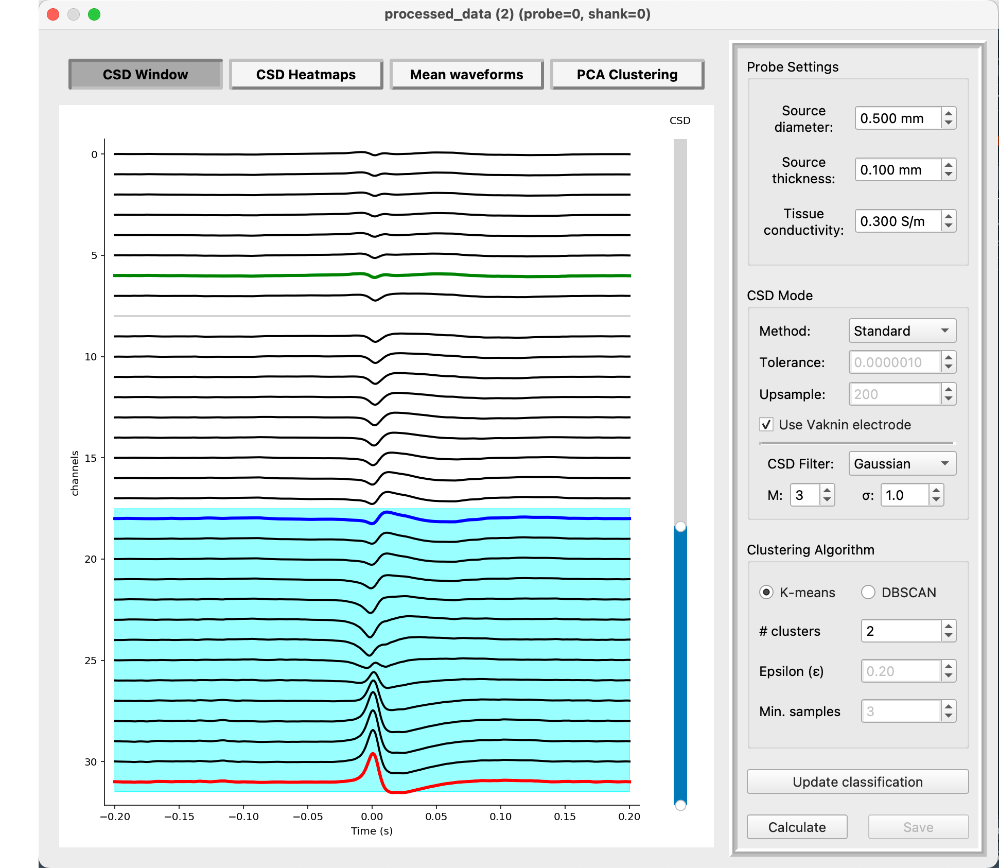

### <ins>Set the CSD Window</ins>

The central plot shows the mean LFPs for each channel surrounding DS events, using the same color-coding to label the DS/hilus channel (red), the SPW-R channel (green), and the theta/fissure channel (blue). Noisy channels are shown as flat gray lines and interpolated for CSD calculation 

<p></p>
The <i><ins>CSD slider</ins></i> controls the range of the CSD window (cyan), which determines the channels used for CSD analysis

* The default CSD window spans from the hilus to the fissure

### <ins>Set the CSD Parameters</ins>

<ins>Probe Settings</ins>: spatial and electrical properties of the current source<br>
<ins>CSD Mode</ins>: parameters for calculating and filtering CSDs<br>
<ins>Clustering Algorithm</ins>: parameters for clustering analysis (K-means or DBSCAN)<br>

****Additional details are available in the main Parameter Window*


<b><ins>Calculate</ins>:</b> estimate CSDs using the <code>icsd</code> Python module<br>
<b><ins>Save</ins>:</b> save CSDs and classifications to disk

<br>

<p align="center">
  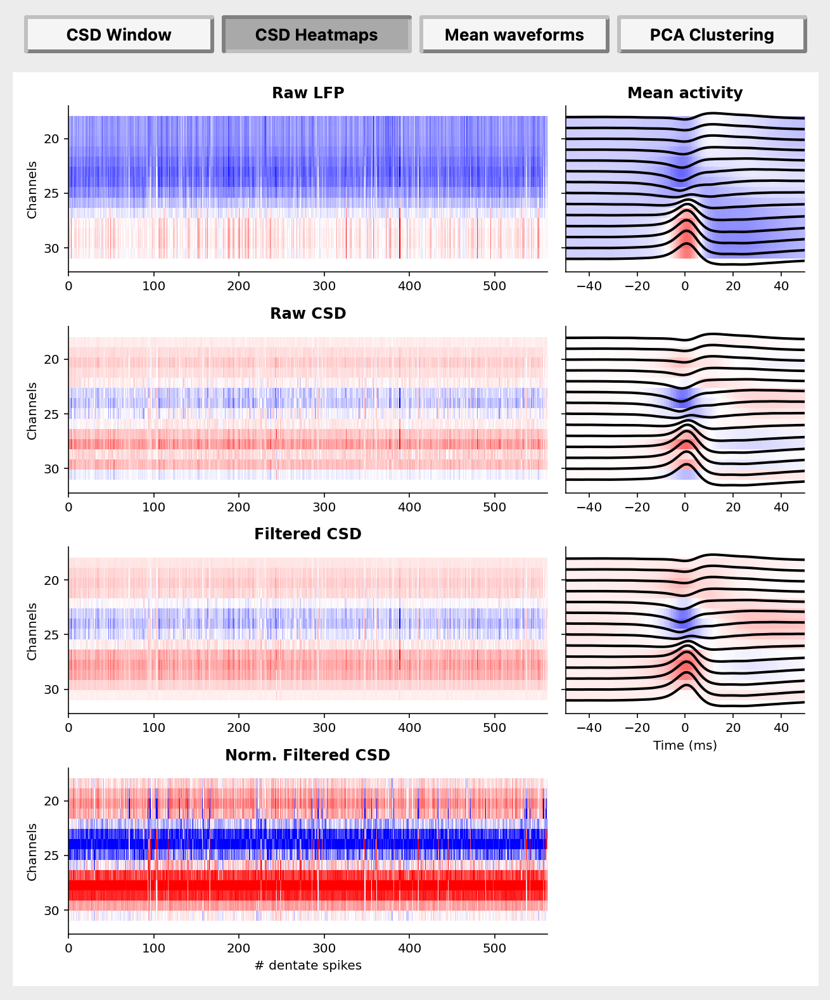 &nbsp;
  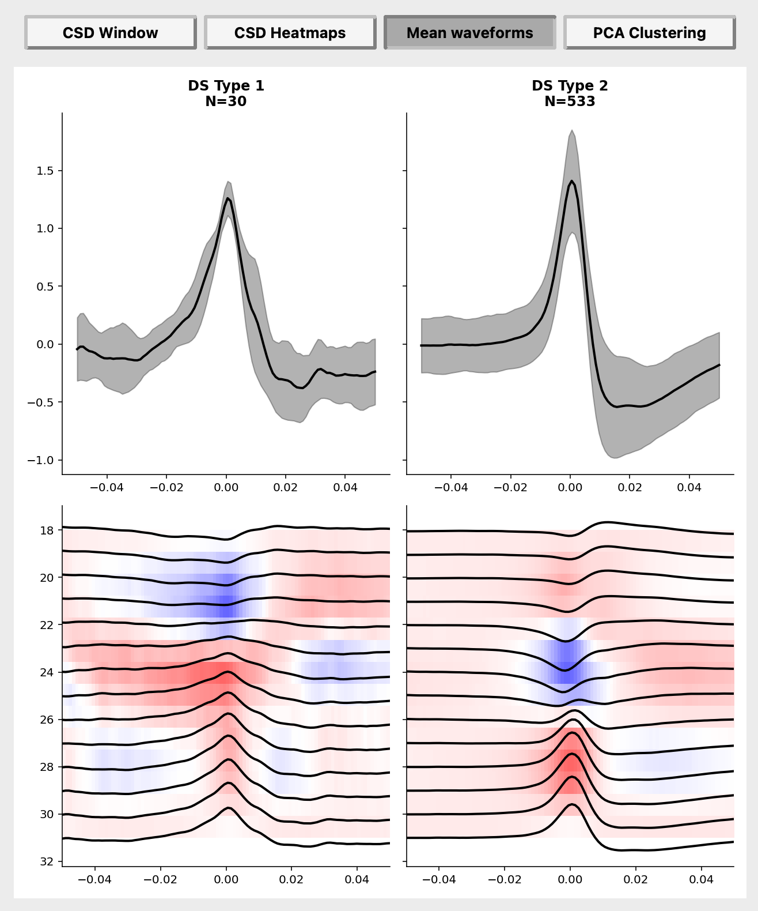 &nbsp;
  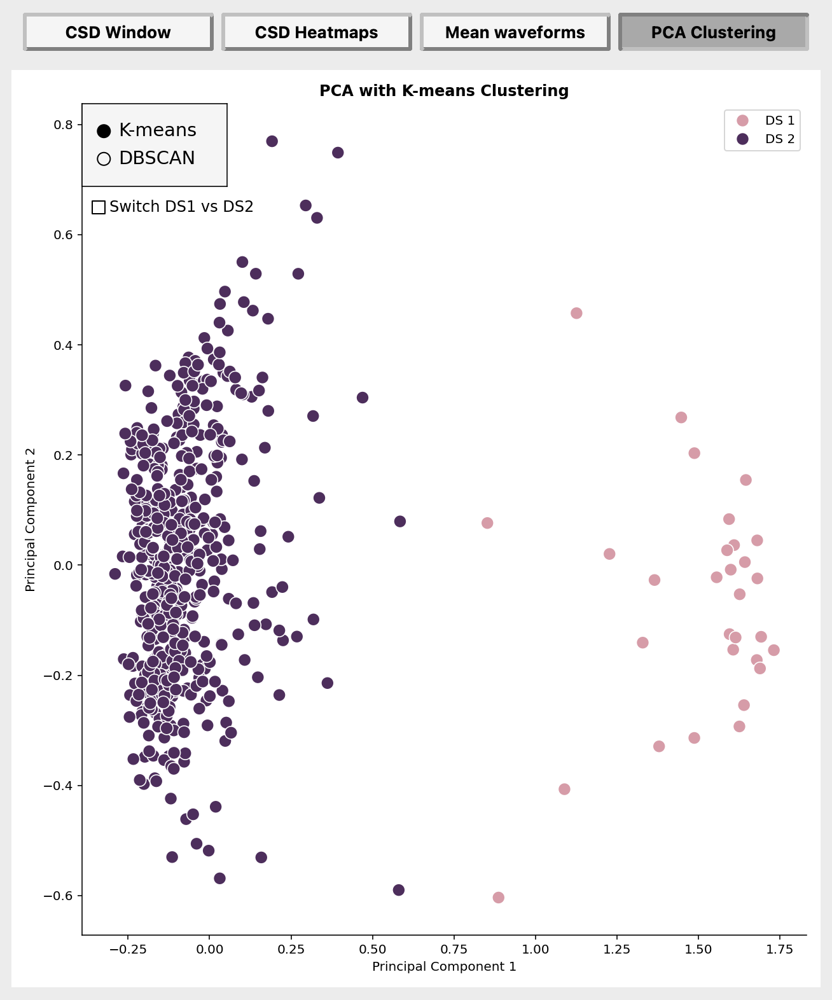
</p>

# Convenience
The following sections provide helpful "convenience" interfaces that you can optionally use to make your Toothy workflow smoother: (1) Setting paths for file searching, (2) Setting parameters, and (3) Creating probe configuration files. All three of these features are also built-in to the normal Toothy workflow.

## <ins>Set paths</ins>
The "Set paths" window allows users to point Toothy towards default folders and files for data analysis. This information is stored in a ```default_folders.txt``` file, which is automatically generated the first time Toothy is run.

<p align="center">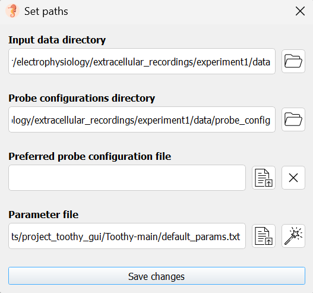</p>

<b><ins>Input data directory</ins>:</b> Select the directory where your recordings are stored; the first time you run Toothy, this will be set to the Toothy folder itself. Updating this location is optional but may make your workflow more convenient when selecting a recording for initial processing.

<b><ins>Probe configurations directory</ins>:</b> Select the directory where your probe configuration files are stored. The first time you run Toothy, the application automatically creates a ```probe_configs``` directory within the Toothy folder and creates a ```demo_probe_config.json``` file as an example probe object.

<b><ins>Prefered probe configuration file</ins>:</b> Select a probe configuration file to have automatically loaded during data processing. If your recordings tend to use the same probe, selecting a probe configuration file may be convenient. Even if a file is selected here, the specific probe configuration used for processing a given file can be changed during the data ingestion stage. If this field is left empty, the user will select a probe manually for each recording.

<p>
<b><ins>Parameter file</ins>:</b> Select the TXT file containing the parameter values that you want to use for data processing. The application automatically generates a <code>default_params.txt</code> file with reasonable initial values, which can be changed in the next step. To generate a new parameter file with default values, press the  button.
</p>

---

## <ins>Set the analysis parameters</ins>
The "Set paramters" window allows users to view and edit the parameters used for data processing and analysis, which are stored in the TXT file specified in the previous step.

<p align="center">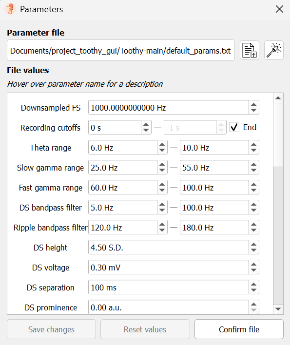</p>

A short description of each parameter can be displayed by hovering over its label, and changes can be saved either to the current parameter file or as a new TXT file.

<br>

## Probe Creation

The probe designer uses the ```probeinterface``` Python package to create a software representation of the electrode geometry and channel mapping of specific neural probes, which is stored as a JSON file. The <b>"Build"</b> window can be used to create a probe completely from scratch by specifying number of channels and electrode geometry, while the <b>"Paste"</b> window accepts input lists of x and y-coordinates.

**<ins>"Build"</ins>**
<p align="center">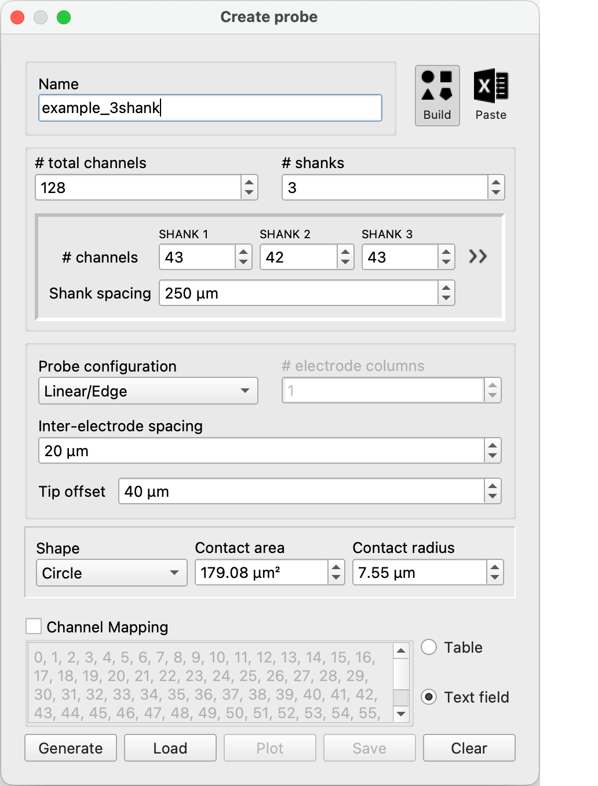</p>

1) Set the number of channels and the number of shanks. For multi-shank probes, the number of channels per shank and the shank spacing (um) must also be specified.

2) Set the electrode geometry as a Linear/Edge configuration (one electrode column per shank), a Polytrode configuration (2+ columns per shank), or a Tetrode configuration (groups of 4 closely spaced electrodes).

3) Set the electrode spacing for the specified probe configuration.
* <ins>Inter-electrode spacing</ins>: distance between electrodes along the shank (*linear/polytrode*)
* <ins>Intra-electrode spacing</ins>: distance between electrodes across the shank (*polytrode*)
* <ins>Inter-site spacing</ins>: distance between tetrode recording sites along the shank (*tetrode*)
* <ins>Intra-site spacing</ins>: distance between the most lateral (X) and vertical (Y) electrodes within a single recording site (*tetrode*)
* <ins>Tip offset</ins>: distance between the tip of the shank and the deepest electrode (*linear/polytrode*) or recording site (*tetrode*). For polytrodes, this parameter can be set individually for each column.
  
4) Set the electrode contact shape (circles, squares, or rectangles) and size (area/radius/width/height).

<br><br>

**<ins>"Paste"</ins>**
<p align="center">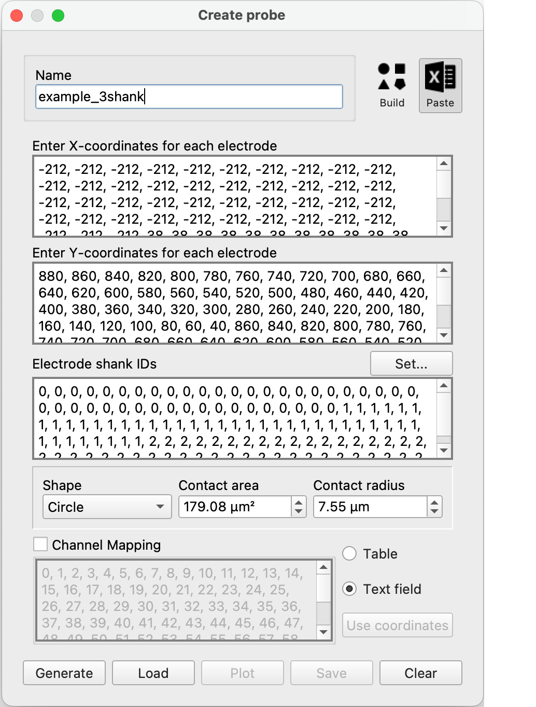</p>

1) Input lists of comma-separated x-coordinates and y-coordinates corresponding to each channel.

2) Set the shank ID for each channel by entering another list into the text field, or by pressing the "Set..." button to manually map each unique x-coordinate to a shank ID.
   
3) Set the electrode contact shape and size.

<br>

**<ins>Channel Mapping:</ins>** set the device indices for mapping the contact indices of the probe to the logical channel indices of the recording device; this depends on the wiring of the particular probe and headstage. Data may be entered as comma-separated values ("Text field") or as values in a table column ("Table")

* If the "Channel Mapping" box is left unchecked, Toothy will assume that the Nth electrode contact corresponds to the Nth row of raw data

* When creating a probe from x and y data, the "Use coordinates" button enables automatic mapping of the contact indices to the physical channel positions. For instance, device index 0 is the index of the shallowest contact (maximum y-value) on the leftmost electrode column (minimum x-value) in the inputted lists of x and y-coordinates

<p align="center">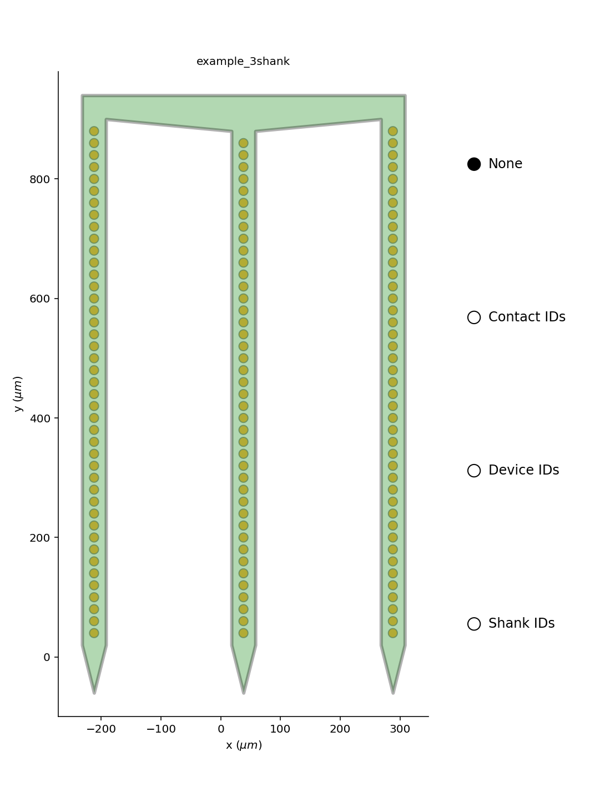</p>

<br><br>

**<ins>Actions</ins>**

When all necessary probe parameters have been supplied, the **<ins>Generate</ins>** button (bottom row) will create a ```probeinterface.Probe``` object and launch a pop-up window with a visual representation of the probe. This external plot can interactively display the contact indices, device indices, and shank IDs over each channel to ensure that the configuration is correct.

<ins>Other Buttons</ins>

**<ins>Load:</ins>** load existing probe configuration file into the "Build" or "Paste" window

**<ins>Plot:</ins>** view the current probe in the external plotting window

**<ins>Save:</ins>** save the current probe as a JSON configuration file

**<ins>Clear:</ins>** reset all probe parameters to their default states

<br><br>
